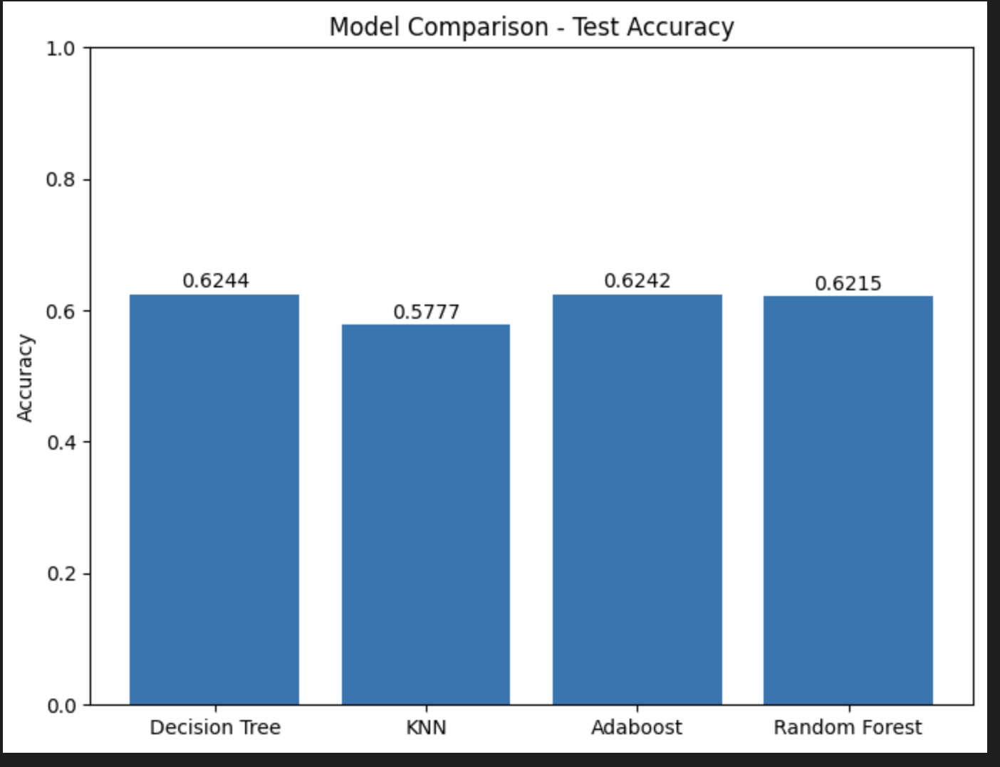
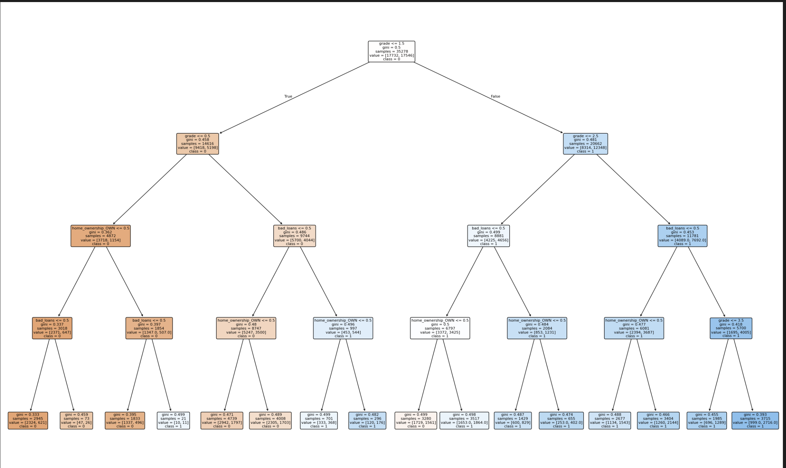

### گزارش پروژه پایانی هوش مصنوعی پاییز ۱۴۰۳
### حسین بابازاده | 401521066
#### پیاده سازی knn
- همانند بقیه مدل ها یک تابع fit و یک تابع train برای آن تعریف شده است.
این کلاس یک پارامتر k هم به عنوان ورودی میگیرد.
- ترین knn هزینه خاصی ندارد. هزینه اصلی در زمان inference است یعنی زمانی که میخواهیم کلاس یک نمونه را تشخیص دهیم. برای اینکار باید فاصله آن نقطه را با نقاط دیتا ترین بررسی کرد.

### لود و پراسس دیتاست
- در اینجا ابتدا فایل را از csv میخوانیم. البته صرفا ستون هایی که نیاز داریم را میخوانیم تا در ram صرفه جویی شود. 
سطر هایی از فایل که شامل مقدار null هستند را حذف میکنیم. در واقع اینکار نمونه از data cleaning است.

- سپس به انکد کردن مقادیر میپردازیم. با توجه به نوع ستون و مقادیر آن سعی میکنیم اندر مناسبی انجام دهیم.
به عنوان مثال برای emp_length خوب است که به نسبت سال ساخت عددی اختصاص داده شود یعنی 10 سال با 9 سال فاصله کمتری دارد پس اعداد متناسب را مپ میکنیم. یا مثلا برای home_ownership از hotones استفاده میکینم.

- سپس سمپلینگ انجام میدهیم. دلیل اینکار این است که دیتا ترین یکدست باشد و نسبت  به کلاسی بایاس نشود که در این صورت ممکن است overfitting رخ دهد.

- در انتها با نسبت 80 درصد دیتا را بین ترین، ولیدیشن و تست تقسیم میکنیم.

#### ترین مدل
- مدل knn: همانطور که پیشتر گفته شد این مدل در واقع ترین ندارد و صرفا باید دیتا ترین را در مدل ذخیره کنیم.
- مدل DecisonTree: این مدل در واقع از طریق تابع fit ترین میشود و سپس آماده inference است. با توجه به اینکه از تابع آماده استفاده شده به جزئیات ترین نمیپردازیم.
- مدل RandomForest: این در واقع شبیه همان DT است با این تفاوت که با پارامتر های مختلف ترین میشود تا بهترین دقت را بین پارامتر ها بدست آورد. منظور از پارامتر اینجا همان هایپر پارامتر ها می باشد.
- مدل Ada boost: این مدل یک مدل ضعیف تر مثل DT را به عنوان مدل پایه میگیرد. این مدل به نمونه ها وزن میده و با مدل ضعیف شروع میکند و مقدار لاس را حساب میکند با توجه به ارور مجدد وزن ها آپدیت میشوند در نهایت به ترکیب وزن دار میرسه که میشه مدل خروجی.

#### بدست آوردن دقت مدل
- با توجه به دیتا ترین،مدل را آموزش میدهیم و با استفاده از دیتا ولیدیشن هایپرپارامتر ها را فیکس میکنیم پس حالا دیتا تست را به مدل میدهیم تا predict کند سپس با لیبل آن مقایسه میکنیم تا دقت آن بدست بیاید.

- برای مدل های گفته شده دقت به صورت زیر است:

- این هم نمای درخت تصمیم(DT)

