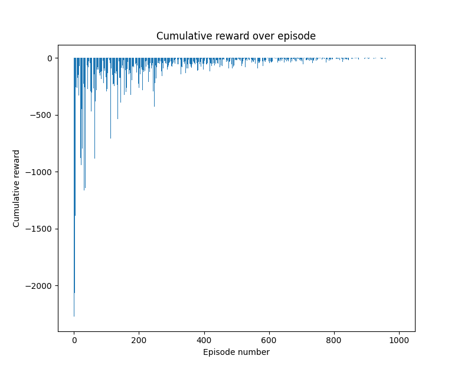
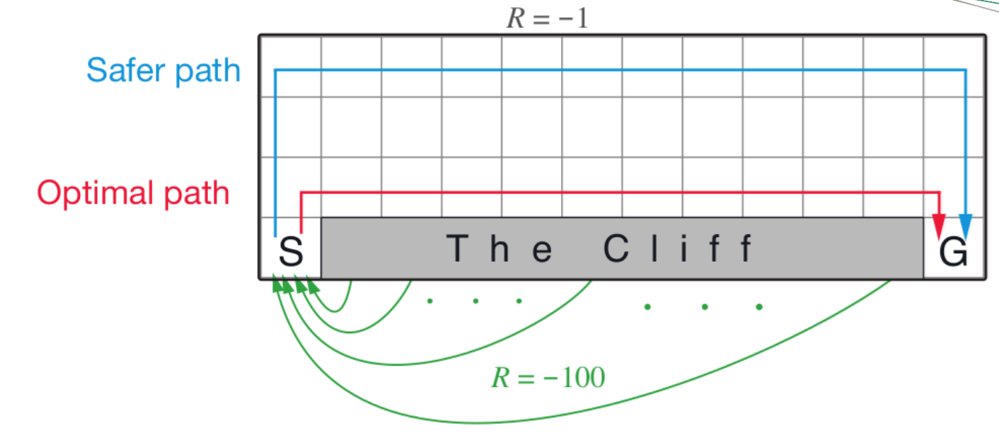
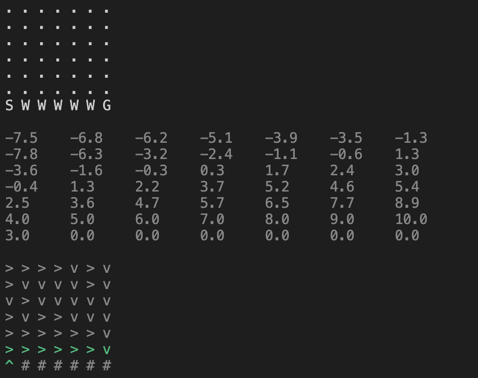
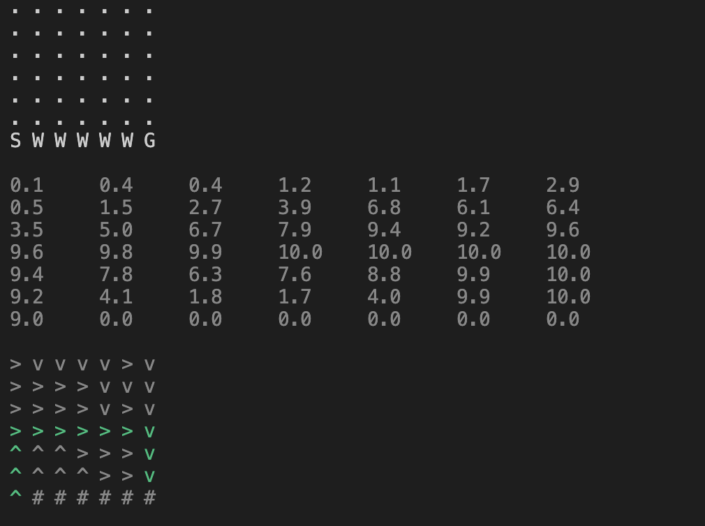

## گزارش تمرین عملی RL
### حسین بابازاده | 401521066
### کلیات
به طور کلی مراحل پروژه رو به میتوان به صورت زیر تقسیم بندی کرد:
- در نظر گرفتن مدل برای QLearning، در اینجا دو مدل sarsa و sarsamax پیاده سازی شده است.
- در نظر گرفتن کلاس Maze که یکی از فیلد های آن مدلی است که قرار است با توجه به آن traint شود.
- ساختن episode برای آپدیت و آموزش مدل
- استخراج سیاست با توجه به Q

### جزئیات
برای کلاس مدل Qlearning دو نوع مدل معروف sarsa و sarsamax را درنظر گرفتیم. همچنین هایپر پارامتر های کلاس عبارتند از epsilon, alpha, gamma. برای تغییر این موارد کافی است مدلی که در main ساخته را تغییر دهیم.

مورد بعدی ساخت Maze به صوت تصادفی است. برای اینکار دو خانه را برای S و G درنظر میگیرم. همچنین با نسبتی خانه های دیوار را درنظر میگیریم. دقت شود اگر کد را ران کردیم و گیر کرد احتمالا به این خاطر است که Maze ای که generate شده به صورتی بوده که هیچ راهی از S به G وجود نداشته به همین دلیل گیرمیکند. برای امتحان کردن یک maze دلخواه کافی است که در کد به صورت hard-coded آن را قرار دهید. نمونه از این مورد در code وجود دارد. حالت دیگر این است که maze به صورت رندوم generate شود برای این مورد لازم است که خط های 238 تا 250 از کامنت دربیان و خط های 224 تا 235 کامنت شوند.

مرحله بعدی ایجاد episode برای آموزش مدل است. برای اینکار از خانه اول شروع میکنیم و باتوجه به مدل اکشن هایی بعدی انتخاب و اعمال میشوند و مدل آپدیت میشود. تعداد این iteration ها نیز از طریق مدل maze در main قابل تغییر است.
مورد مهم در اینجا مقدار alpha و مقدار epsilon است. از این جهت که چه مقدار iteation های اخیر در آپدیت سهم داشته باشند و اینکه چقدر از انتخاب اکشن ها صرف exploration شود و چقدر صرف explotation. که همانطور که پیشتر گفته شد این موارد به راحتی از طریق model که main تعریف شده قابل تغییر هستند. باید توجه کرد که مقدار epsilon در طول زمان به صورت خطی کاهش میابد.

بعد از اتمام train نوبت استخراج سیاست است یعنی باید بتوانیم بگوییم در هر خانه بهترین action کدام است. با توجه به آپدیت های Q این مقادیر استخراج میشوند. به این صورت که در هر خانه action ای را انجام میدهیم که Q ماکسیمم شود، به این ترتیب سیاست استخراج میشود و به عنوان خروجی print میکنیم.

در انتها هم با توجه به سیاست از خانه S شروع میکنیم و انتظار داریم به خانه G برسیم.
که این مورد نیز با رنگ دیگر print میشود.

### فیچر ها
خانه از نوع X مخفف experience تعریف شده که نشان دهنده اهداف چندگانه است. به این صورت که امتیاز هر خانه X برابر با 8 میباشد. توصیه میشود ابتدا یک بار maze بدون X امتحان شود و یکبار هم maze به همراه خانه های X.

برای اینکه به خانه تکراری نرویم بعد از ورود به هر خانه آن را mark میکنیم و در صورت ورود مجدد به آن خانه reward برابر با -3 را در نظر میگیریم. توجه کنید پیاده سازی این مورد برای خانه های X الزامی است چون در غیر این صورت مدل سعی میکند به صورت تکراری و پشت سرهم وارد خانه X شود که امتیاز مثبت دارد و terminal هم نیست.

نمایش مسیر پیشنهادی مدل با توجه به سیاست با رنگی متمایز.

نمایش تابع پاداش تجمعی در طول اپیزود ها. در زیر عکسی از پاداش تجمعی را مشاهده میکنیم که از 500 تقریبا میتوان گفت converge میکند.

### کمی کنجکاوی
در اسلاید های rl بخشی داشتیم تحت عنوان off_policy و on_policy. در این قسمت نشان داده میشد که الگوریتم sarsa به عنوان یه الگوریتم on_policy مسیر امن تر(safer) را انتخاب میکند و الگویتم sarsamax به عنوان یه الگوریتم off_policy مسیر بهینه تر(optimal) را انتخاب میکند.

حالا من این ورودی را به برنامه دادم به ازای دو الگوریتم امتحان کردم و نتیجه مشابه اسلاید بود :)

البته باید توجه کرد برای ران کردن این تست reward هایی متفاوت از سوال درنظر گرفته شده.

ابتدا برای sarsamax داریم:

سپس برای sarsa داریم:

